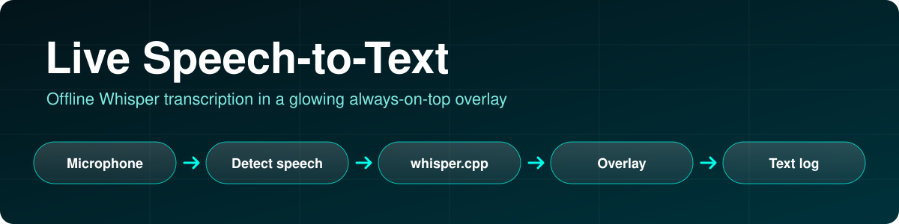
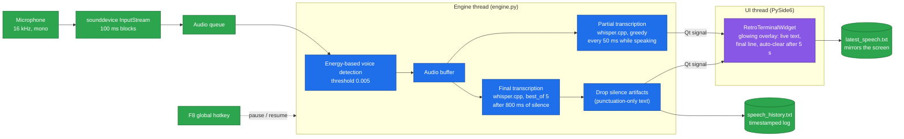

<p align="center">
  
</p>

<p align="center">
  
  
  
  
</p>

# Live Speech-to-Text (Windows overlay)

**A desktop app that listens to your microphone and shows what you say as live text in a glowing, always-on-top "retro terminal" window. Transcription runs fully offline with [whisper.cpp](https://github.com/ggerganov/whisper.cpp).**

Words appear while you are still speaking, then the line is finalized with a more accurate pass when you pause. Every finalized sentence is also written to a timestamped history file.

---

## Key features

- **Live captions**: partial text updates about every 50 ms while you speak, then a final, higher-quality transcription after a pause.
- **Offline and private**: speech recognition uses a local whisper.cpp model (default `ggml-base.en.bin`). Nothing is sent to a cloud service.
- **Overlay window**: frameless, translucent, always on top and draggable, with minimize / maximize / close buttons, a glow effect, a typing animation and a blinking cursor.
- **Global hotkey**: press `F8` from any application to pause or resume listening.
- **Two display modes**: `live` (one line that is overwritten) or `timeline` (scrolling lines).
- **Text output for other tools**: `speech_history.txt` keeps a timestamped log, and `latest_speech.txt` mirrors what is currently on screen.
- **Fully configurable** through `config.yaml`: model, silence length, voice threshold, colors, font, size, position, display time.
- **Silence filtering**: results made only of punctuation (typical Whisper output on silence) are discarded.
- **Packageable**: `build_exe.py` builds a single-file `RetroSTT.exe` with PyInstaller.

---

## Architecture



### How it works

1. `sounddevice` streams 16 kHz mono audio from the microphone into a queue.
2. The engine thread measures the energy of each block. Above `vad_threshold` it marks you as speaking and buffers the audio.
3. While you speak, the buffered audio is transcribed repeatedly with fast greedy decoding, and the partial text is sent to the UI through a Qt signal.
4. After `pause_amount` milliseconds of silence, the buffer is transcribed again with `best_of: 5` for the final text. That text is shown, appended to `speech_history.txt`, and mirrored to `latest_speech.txt`.
5. `F8` toggles a pause flag so the engine ignores audio until you press it again.

---

## Project structure

```
live-speech-to-text-windows/
├── main.py             # Qt main window, threads, global hotkey
├── engine.py           # audio capture, voice detection, whisper.cpp transcription
├── ui_components.py    # glowing label with typing effect, terminal widget
├── config_loader.py    # reads config.yaml (also works inside the PyInstaller bundle)
├── config.yaml         # all settings
├── logger.py           # history and latest-text files
├── download_model.py   # downloads the whisper.cpp model
├── verify_stt.py       # smoke test: loads the model and transcribes silence
├── build_exe.py        # PyInstaller build script
└── requirements.txt
```

---

## Setup

Developed for Windows. The requirements are `numpy`, `sounddevice`, `pywhispercpp`, `PySide6`, `keyboard` and `pyyaml`.

```bash
git clone https://github.com/talha142/live-speech-to-text-windows.git
cd live-speech-to-text-windows

python -m venv venv
venv\Scripts\activate
pip install -r requirements.txt
```

Download the speech model (a one-time download from Hugging Face, saved to `models/`):

```bash
python download_model.py
```

Optional check that the model loads and the engine starts:

```bash
python verify_stt.py
```

## Usage

```bash
python main.py
```

- Speak: live text appears in the overlay, then the finalized line replaces it.
- Press `F8` to pause or resume listening.
- Drag the window to move it, and use the header buttons to minimize, maximize or close it.

### Build a standalone executable

```bash
pip install pyinstaller
python build_exe.py
```

This creates a single-file `RetroSTT.exe` in `dist/`, with the model and `config.yaml` bundled inside. Because the config is bundled, rebuild after changing it. The history files are written to the folder you launch the app from.

## Configuration

Everything lives in `config.yaml`. The main options:

| Setting | Default | Meaning |
|---|---|---|
| `stt.model_path` | `models/ggml-base.en.bin` | whisper.cpp model file |
| `stt.language` | `en` | Recognition language |
| `stt.pause_amount` | `800` | Silence (ms) that ends a sentence |
| `stt.vad_threshold` | `0.005` | Energy level treated as speech; raise it in noisy rooms |
| `stt.streaming_interval` | `50` | How often live text updates (ms) |
| `output.mode` | `live` | `live` overwrites one line, `timeline` scrolls |
| `display.display_time_ms` | `5000` | How long a finished line stays on screen (`live` mode) |
| `display.text_position` | `bottom-center` | Position of the text inside the window |
| `display.font_size`, `font_family`, `glow_color`, `text_color`, `background_opacity` | see file | Look and feel |
| `window.width`, `height`, `always_on_top`, `framed` | `600`, `200`, `true`, `false` | Window behavior |
| `window.hotkey` | `f8` | Global pause/resume key |

Other Whisper models (for example `small.en` or a multilingual one) can be downloaded from the same Hugging Face repository and selected with `stt.model_path` and `stt.language`.

---

## Limitations

- The default model is English-only. A larger or multilingual model is needed for other languages, and larger models need more CPU.
- Voice detection is a simple energy threshold, so background noise can trigger it. Tune `vad_threshold`.
- Each live update re-transcribes the audio buffered so far, so CPU use grows during long uninterrupted speech.
- `stt.beam_size` is read from the config, but the final pass uses greedy decoding with `best_of: 5`, so changing it has no effect.
- `speech_history.txt` stores everything recognized in plain text. It is git-ignored, but treat it as private.
- The global hotkey uses the `keyboard` library, and the build script uses Windows path syntax. Other platforms are untested.
- `verify_stt.py` is a smoke check, not an automated test suite.

## Future improvements

- Add a screenshot or short demo GIF of the overlay.
- Add a proper voice-activity detector instead of the energy threshold.
- Add a settings dialog and a language selector.
- Add unit tests for the segmentation and filtering logic.
